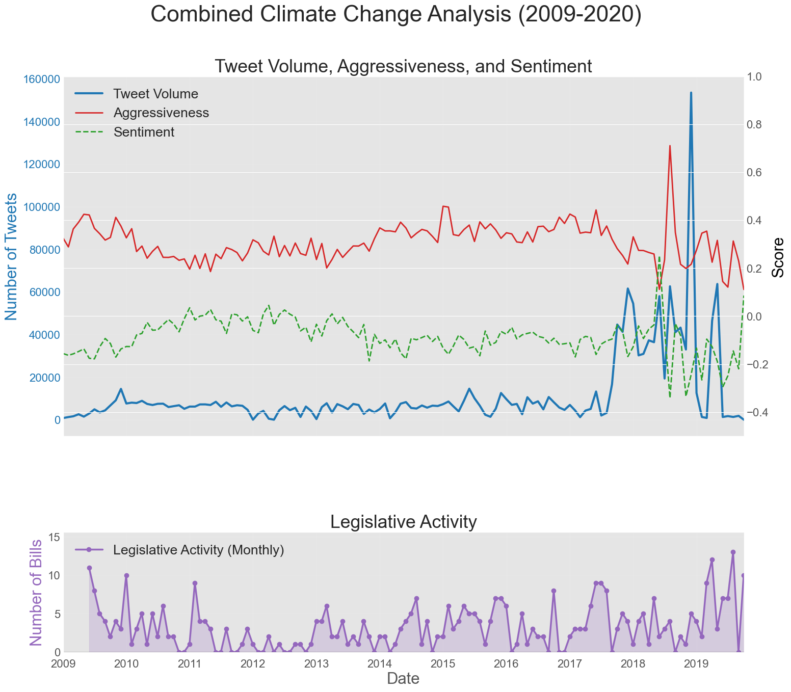
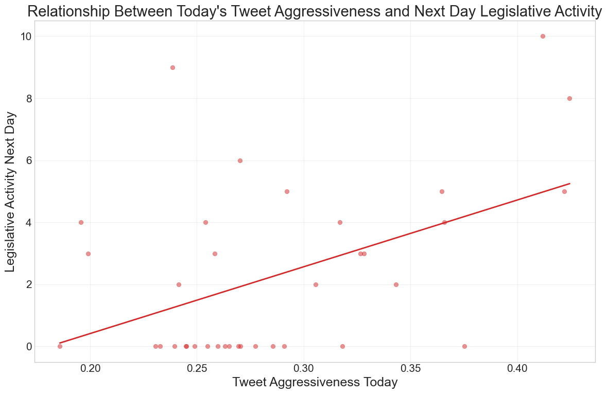
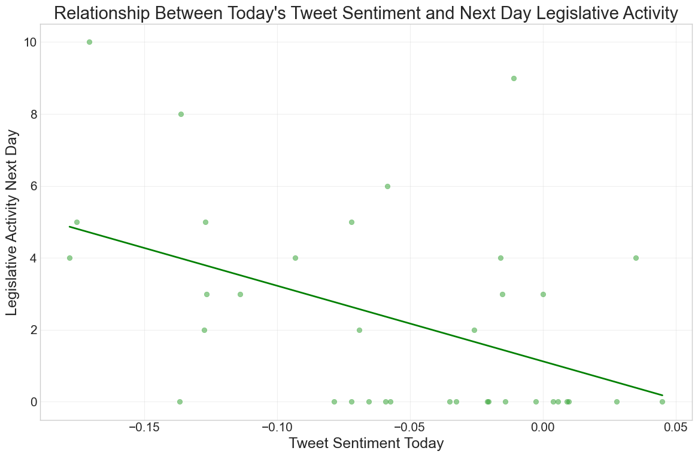
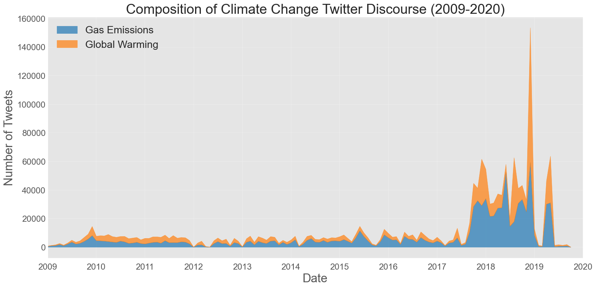
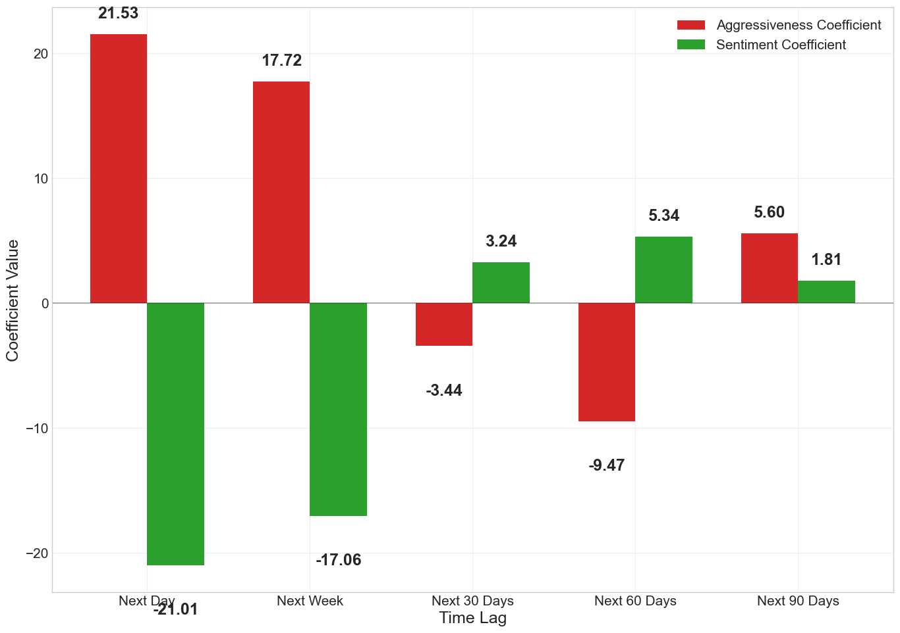

# Legislative Impact Analysis

This project analyzes the relationship between social media aggressiveness, sentiment, and legislative activity related to climate change. It examines how online discussions influence legislative actions using datasets on climate change tweets and legislative bills.

## Project Structure
- **Data Loading:** Load climate change tweets and legislative bill data.
- **Data Preparation:** Process and filter tweets and bills based on topics like *Seriousness of Gas Emissions* and *Ideological Positions on Global Warming*.
- **Legislative Response Analysis:** Analyze correlations between tweet metrics (aggressiveness, sentiment, volume) and legislative activities.
- **Visualization:** Plot tweet metrics and legislative actions to observe trends and relationships.

## Datasets
- **Climate Change Twitter Dataset:** Contains tweet IDs, topics, aggressiveness scores, sentiment scores, and timestamps.
- **Bill Data:** Contains bill titles, sponsors, party affiliations, and dates of introduction.

## Key Functions
1. `prepare_topic_based_data()`: Prepares and filters data for each topic of interest.
2. `analyze_topic_legislative_response()`: Analyzes correlations and legislative response timings.
3. `plot_topic_relationships()`: Visualizes relationships between tweet metrics and legislative actions.
4. `analyze_tweet_metrics_legislative_impact_extended(topic_analysis)`: Performs comprehensive time lag analysis across multiple time horizons (next day, next week, 30, 60, and 90 days):
   - Calculates weighted averages of tweet metrics across different climate change topics
   - Creates time-shifted features for short-term (next day, next week) and extended time horizons (30, 60, 90 days)
   - Performs regression analysis between current social media metrics and future legislative activity
   - Visualizes relationships with scatter plots and regression lines
   - Handles data with greater statistical rigor by properly managing missing values

## Analysis Output
- Statistical relationships between tweet metrics and legislative activity across multiple time horizons (next day, next week, 30, 60, and 90 days)
- Regression analysis results showing how tweet aggressiveness and sentiment predict future legislative actions
- Visualization of relationships between social media metrics and legislative activity with scatter plots and regression lines
- Time-lagged correlations revealing how sustained social media discourse influences policy decisions
- Comparative analysis of different climate change topics and their relative impact on legislation

## Visualization Gallery

The analysis produces several key visualizations that illustrate the relationship between social media discourse and legislative activity:

### Trends of Tweet volume and Legislative activity



### Time Lag Analysis Visualizations






### Topic-Specific Analysis




### Comparative Analysis



## Dependencies
- `pandas`
- `numpy`
- `matplotlib`

## How to Run
1. Ensure the required datasets are available: *The Climate Change Twitter Dataset.csv* and *Bill_new.xlsx*.
2. Install dependencies using:
   ```bash
   pip install pandas numpy matplotlib
   ```
3. Run the notebook in a Jupyter environment.

## Future Improvements
- Expand to more topics related to climate policy.
- Integrate NLP for advanced topic filtering and analysis.
- Expand analysis to include the bills that were actually passed and became a law.


